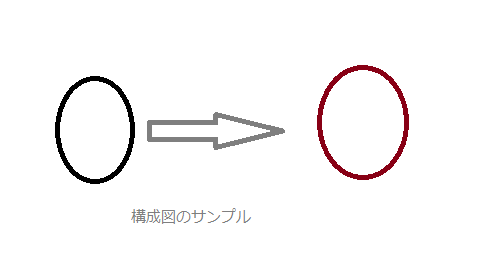
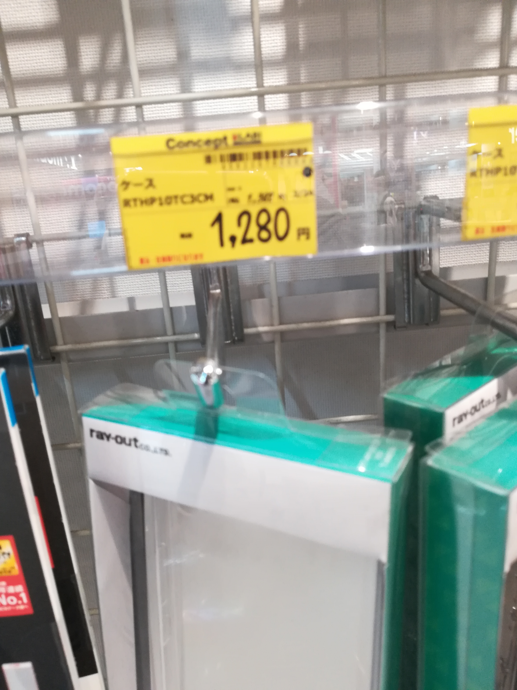

## 2.1 システム概要

- 機関投資家とマーケットメイカーは CONNEQTOR を通じて気配提示依頼や気配提示を行い、CONNEQTOR はマッチした注文等の情報を本仕様書に定める接続仕様に準じて参加者システムに
連携する。参加者システムまたは CONNEQTOR は ToSTNeT システム間接続仕様書・FIX 接続仕様書に準じて ToSTNeT に注文する。

- CONNEQTOR は、arrownet(注１)またはインターネットを経由して参加者システムの FIX クライアントに接続する。

- 参加者システムは、CONNEQTOR と通信を行うためのＦＩＸクライアントを設置する。FIX クライアントは、FIX V4.2(Errata)に準拠した FIX サービス（注２）と FIX アプリケーション（注３）が存在する。

- 参加者システムのＦＩＸサービスは、CONNEQTOR の FIX サービスと実際に通信を行うＦＩＸの制御部である。FIX アプリケーションは、接続要求（Logon）により CONNEQTOR との間に FIX セション（論
理リンク）（注４）を確立する。

- FIX サービスは参加者側にて用意する必要がある。また、ＦＩＸアプリケーションは、後述の電文シーケンス及び、電文フォーマットに従い参加者側にて作成する必要がある。

- FIX サービスと FIX アプリケーションは１つのアプリケーションとして存在しても特に問題はない。（参加者側のシステムに依存）

（注１）arrownet への接続にあたっては「arrownet version2.0 ガイドライン【ネットワーク接続_共通編】」「arrownet version2.0 ガイドライン【ネットワーク接続_JPX 編】」及び「arrownet version2.0 ガイ
ドライン【手続き・運用_共通編】」「arrownet version2.0 ガイドライン【手続き・運用_JPX 編】」に記載されているルールにしたがって必要なネットワーク設定を行うこと。  
（注２）ＦＩＸサービスとは、ＦＩＸプロトコルに準拠したメッセージの送受信制御部分を実装するアプリケーションである。  
（注３）ＦＩＸアプリケーションとは、ＦＩＸサービスの上位に位置するもので、東証ＦＩＸ接続仕様書に準拠したＦＩＸ業務メッセージの分解、チェック、組立て等を実装するアプリケーションである。  
（注４）１ＦＩＸセションは、CONNEQTOR で対応しているシステム区分単位に括り付けとし、１ＦＩＸセションは１システム区分にかかる取引区分の業務のみを行う。  

### 2.1.1 本番面
 - 本番面は本システムのサービスを利用することを目的とした環境である。利用可能時間は取引日の 8:00（JST）から 18:00（JST）である。
 - 取引日の 8:00（JST）に、CONNEQTOR は全ての参加者システムの FIX クライアントに対してログオンを試みる。
 - 図 2.1.1 に示す CONNEQTOR（本番面）、プライマリセンタの ToSTNeT・NW 機器、arrownet の広域被災時においては、同環境でのサービス再開を目指し、当該機器が復旧するまで本サービスを
停止する。また、耐障害性を考慮し参加者システムの FIX クライアントは同一 IP アドレスまたは異なる IP アドレスで冗長化することが可能である。
 - 本番面の全体構成イメージを図 2.1.1 に示す。
 - 取引所から参加者システムへは arrownet またはインターネットのいずれかを経由して接続する。
 - 取引日の 18:00（JST）に、CONNEQTOR は参加者システムの FIX クライアントからログアウトを行う。
 
 
 
 
 
図 2.1.1 全体構成イメージ（本番面） 

### 2.1.2 ステージング面
 - ステージング面は、テストを行うことを目的とした環境である。
 - 基本的にテストは平日木曜日、金曜日に実施し、祝日と重なる場合は実施対象外とする（平日月曜日～水曜日は FIX 未接続でのテスト等を行う）。
 - テスト実施日の 8:00（JST）に、CONNEQTOR は全ての参加者システムの FIX クライアントに対してログインを試み、FIX セションを確立した参加者システムのみをテストの参加対象とみなす。
 - テストの途中に参加者起因（参加者システムのメンテナンス作業等）で FIX セションが切断された場合は、再ログインを試みない。
 - CONNEQTOR 起因（CONNEQTOR のシステム障害等）で FIX セションが切断された場合は、再度全ての参加者システムの FIX クライアントに対してログインを試みる。
 - 投資家、マーケットメイカーが、FIX のログインを行っていない証券会社を選択してマッチングした場合、証券会社と通信できないため、マッチング処理以降のテストを実施することができない。こ
のため、取引所は擬似参加者を用意し、投資家、マーケットメイカーは擬似参加者を選択してテストすることを可能とする。
 - また、図 2.1.2 に示す CONNEQTOR（ステージング面）、プライマリセンタの NW 機器、セカンダリセンタの ToSTNeT、arrownet の広域被災時は、同環境でのサービス再開を目指し、当該機器が
復旧するまでテスト実施対象外とする。
 - ステージング面の全体構成イメージを図 2.1.2 に示す。
 - 取引所から参加者システムへは arrownet またはインターネットのいずれかを経由して接続する。

